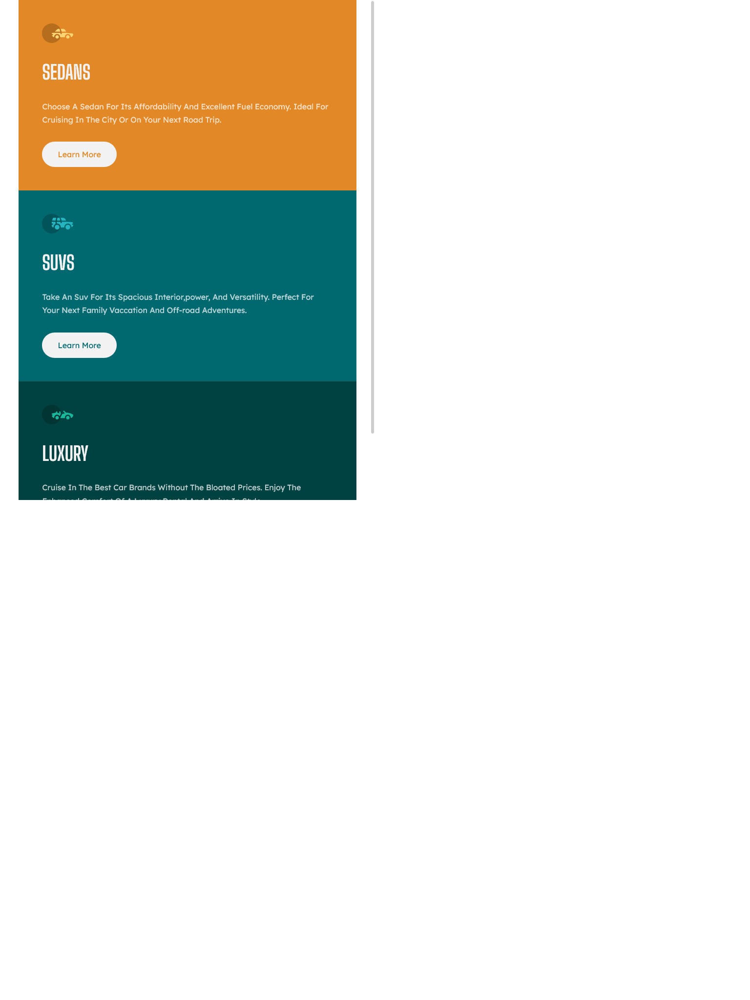

# Frontend Mentor - 3-column preview card component solution

This is a solution to the [3-column preview card component challenge on Frontend Mentor](https://www.frontendmentor.io/challenges/3column-preview-card-component-pH92eAR2-).


## Table of contents

  - [Overview](#overview)
  - [The challenge](#the-challenge)
  - [Screenshot](#screenshot)
  - [Links](#links)
  - [My process](#my-process)
  - [Built with](#built-with)
  - [What I learned](#what-i-learned)
  - [Continued development](#continued-development)
  - [Useful resources](#useful-resources)
  - [Author](#author)
  - [Acknowledgments](#acknowledgments)

**Note: Delete this note and update the table of contents based on what sections you keep.**

## Overview

The challenge is to build out this 3-column preview card component and get it looking as close to the design as possible. Any tool is allowed to build it.
### The challenge

Users should be able to:

- View the optimal layout depending on their device's screen size
- See hover states for interactive elements

### Screenshot




### Links

- Solution URL: [The github repository here](https://github.com/Everezze/3-columns-preview-card-component)
- Live Site URL: [The github live page](https://your-https://everezze.github.io/3-columns-preview-card-component/-site-url.com)

## My process

### Built with

- Semantic HTML5 markup
- CSS3 with BEM notation
- Flexbox
- Mobile-first workflow

### What I learned

Use this section to recap over some of your major learnings while working through this project. Writing these out and providing code samples of areas you want to highlight is a great way to reinforce your own knowledge.

To see how you can add code snippets, see below:

```html
<h1>Some HTML code I'm proud of</h1>
```
```css
.proud-of-this-css {
  outline: white solid 2px;
}
```
### Continued development

Use this section to outline areas that you want to continue focusing on in future projects. These could be concepts you're still not completely comfortable with or techniques you found useful that you want to refine and perfect.

**Note: Delete this note and the content within this section and replace with your own plans for continued development.**

## Author

- Website - [My Github Profile](https://github.com/Everezze)
- Frontend Mentor - [@Everezze](https://www.frontendmentor.io/profile/Everezze)