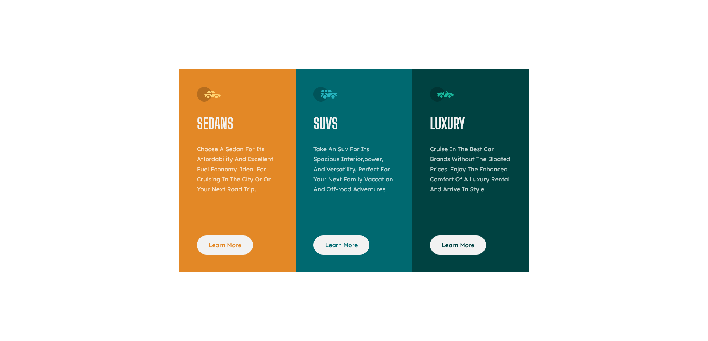

# Frontend Mentor - 3-column preview card component solution

This is a solution to the [3-column preview card component challenge on Frontend Mentor](https://www.frontendmentor.io/challenges/3column-preview-card-component-pH92eAR2-).


## Table of contents

  - [Overview](#overview)
  - [The challenge](#the-challenge)
  - [Screenshot](#screenshot)
  - [Links](#links)
  - [My process](#my-process)
  - [Built with](#built-with)
  - [What I learned](#what-i-learned)
  - [Continued development](#continued-development)
  - [Author](#author)

## Overview

The challenge is to build out this 3-column preview card component and get it looking as close to the design as possible. Any tool is allowed to build it.
### The challenge

Users should be able to:

- View the optimal layout depending on their device's screen size
- See hover states for interactive elements

### Screenshot

Here's the layout in tablet format. I thought I can let it like that, maybe centering the content ?? 


And there is the Layout in desktop format.

### Links

- Solution URL: [The github repository here](https://github.com/Everezze/3-columns-preview-card-component)
- Live Site URL: [The github live page](https://your-https://everezze.github.io/3-columns-preview-card-component/-site-url.com)

## My process

As always structuring the content with HTML on paper, thinking how much tags I need in every part of the project in order to set up some re-usable styles. Then adding the CSS. No need here for dynamic interactions with JS.

### Built with

- Semantic HTML5 markup
- CSS3 with BEM notation
- Flexbox
- Mobile-first workflow

### What I learned

```css
.proud-of-this-css {
  outline: white solid 2px;
}
```
### Continued development

Continuing with flexbox, and also trying to tam the behaviour of box-sizing: border-box; property.
Also just overall trying to place elements with the natural flow of css and not trying to go against it.
## Author

- Website - [My Github Profile](https://github.com/Everezze)
- Frontend Mentor - [@Everezze](https://www.frontendmentor.io/profile/Everezze)